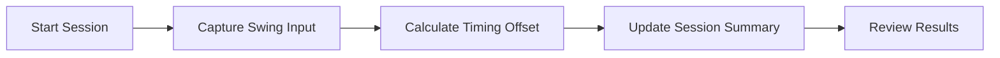

# homerun-hitter-script

*A swing-timing and batting-practice companion for baseball sim players who want to actually feel their home run timing improve.*

**Quick start**

1. Open the [landing page](https://peakchemistpropagate.github.io/homerun-hitter-script/) and grab the latest build.
2. Unzip anywhere — no installer, no admin prompt.
3. Run `homerun-hitter-script.exe` and start your first timing session.

## What this is

homerun-hitter-script is a small standalone Windows tool built for one job: helping baseball simulation players understand and refine the swing timing that turns a normal contact into a home run. It watches your input rhythm during practice reps, logs timing offsets, and gives you a plain-language readout of whether you were early, late, or right on the barrel — session after session, so the pattern actually sticks.

This started as a personal project because I kept losing home run derbies to timing windows I couldn't see. Nothing in this repo touches game files, memory, or network traffic — it's a self-contained companion app that runs alongside whatever baseball sim you're already playing, reading only what you feed it through its own practice interface. It's built to be boring, stable, and honest about what it measures.

  

The button above opens the project's landing page, where you can download the current build directly.

## Who it is for

1. **Baseball sim players** who want measurable swing-timing feedback instead of guesswork.
2. **Home run derby regulars** trying to shave milliseconds off their late swings.
3. **Content creators** who need clean timing data or overlays for batting-practice videos.
4. **Coaches and league organizers** running informal timing drills for their community.
5. **Curious tinkerers** who want a lightweight, readable Windows utility to study or extend.

## What you can do

1. **Track swing timing** across unlimited practice sessions with millisecond-level offset logs.
2. **Review a session summary** showing your early/late tendency as a simple trend, not raw noise.
3. **Set a target timing window** and get immediate pass/fail feedback per rep.
4. **Export session logs** to CSV for your own spreadsheets or content.
5. **Run fully offline** — no account, no telemetry, no background network calls.
6. **Switch between multiple saved profiles** if more than one person practices on the same PC.
7. **Adjust sensitivity presets** to match different sims' swing mechanics.
8. **Keep every build self-contained** — copy the folder, move it, delete it, no residue.

## Getting started

1. Go to the [download page](https://peakchemistpropagate.github.io/homerun-hitter-script/) and download the latest ZIP.
2. Extract it to any folder you like — Desktop, USB drive, anywhere with write access.
3. Launch `homerun-hitter-script.exe`.
4. Pick or create a profile, then start a timing session.
5. Play your practice reps as usual; review your results when you're done.

## Requirements

- Windows 10 or Windows 11 (64-bit).
- No .NET, Python, or Java runtime to install — the build is standalone.
- No build toolchain, compiler, or command-line setup required.
- Roughly 40 MB of free disk space and standard user permissions (no admin rights needed).

## How it works

1. You start a session and the tool arms its timing window.
2. Each practice swing you take is captured as a timestamped input event.
3. The offset between your input and the ideal contact window is calculated.
4. Results are aggregated into a session summary in real time.
5. You review the summary, adjust your timing, and run another session.

## FAQ

**Does this modify or inject into my baseball game?**
No. It runs as an independent window and reads only the input events you generate inside its own practice interface — it never touches another process.

**Will it work with any baseball simulation game?**
It's designed to be sim-agnostic for timing practice, since it doesn't hook into a specific title. If your game has a distinct swing input, you can practice the rhythm here and carry it over.

**Do I need to create an account to use it?**
No. There's no login, no cloud sync, and no telemetry — everything stays on your machine.

**Why is timing offset shown in milliseconds instead of a simple grade?**
Milliseconds are the honest unit. A letter grade hides how close you actually were, and this tool is built around real feedback rather than gamified scoring.

**Can I use my exported CSV data outside the app?**
Yes. The export is plain CSV with timestamps and offsets, so it opens cleanly in any spreadsheet tool or your own analysis script.

## Troubleshooting

1. **The app won't launch.** Confirm you're on Windows 10/11 64-bit and that the ZIP was fully extracted before running the EXE — running from inside the ZIP will fail silently.
2. **Timing feels inconsistent between sessions.** Check your sensitivity preset; a mismatch between preset and your input device is the most common cause.
3. **My CSV export is empty.** Make sure you completed at least one full rep before ending the session — partial sessions don't generate export rows.
4. **Windows flags the EXE on first run.** This is standard SmartScreen behavior for new independent builds; verify you downloaded from the official landing page and proceed if you're comfortable.

## License

Released under the [MIT License](LICENSE). This project is provided as-is, with no warranty of any kind — use it, study it, and adapt it freely within the terms of the license.

  

